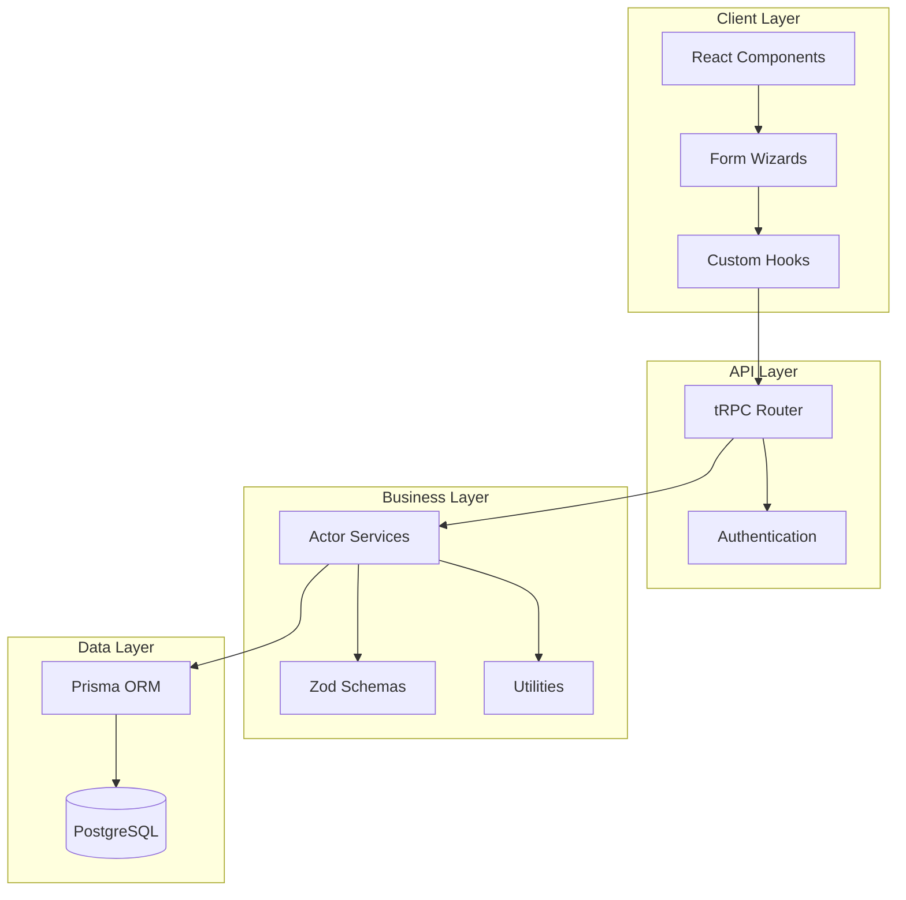
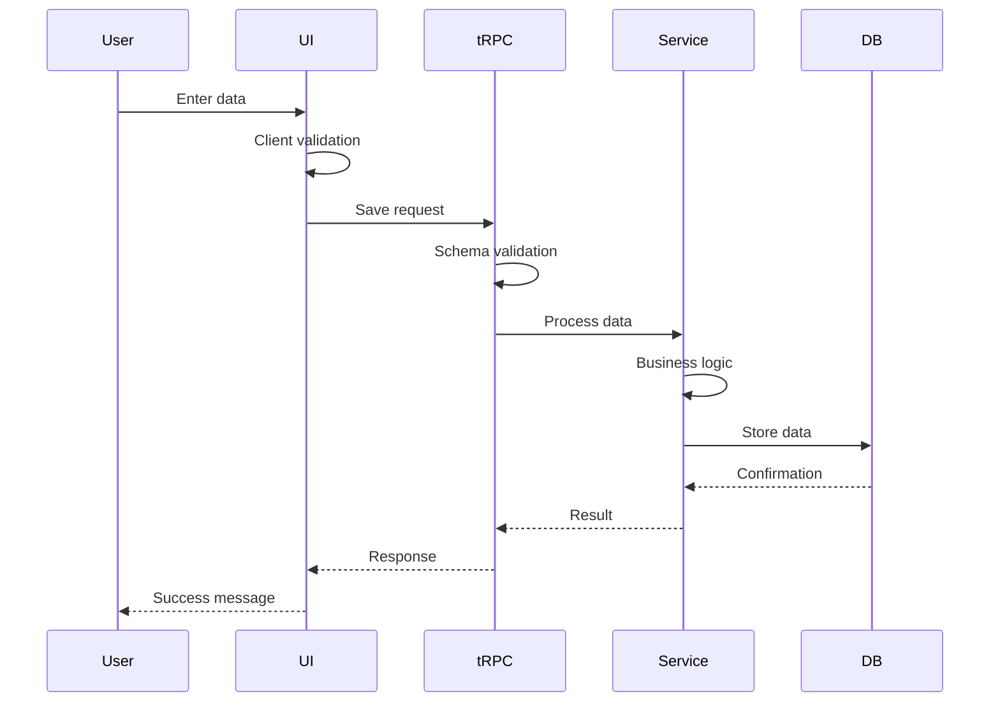
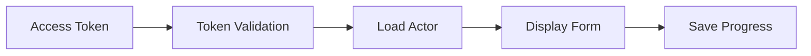

# Actor System Architecture

## Executive Summary

The Actor System is a comprehensive data collection and validation framework for managing rental policy participants (actors). After a complete refactoring, we achieved **60% code reduction** while maintaining full functionality and improving type safety.

## System Overview



## Actor Types

The system handles four distinct actor types:

| Actor | Role | Key Features |
|-------|------|--------------|
| **Tenant** | Property renter | Employment verification, income requirements |
| **Landlord** | Property owner | Multiple support, property details, financial info |
| **Aval** | Property-backed guarantor | Mandatory property guarantee, marriage info |
| **Joint Obligor** | Co-signer | Flexible guarantee (income OR property) |

## Core Architecture Components

### 1. Schema Layer (`/src/lib/schemas`)

**Purpose**: Single source of truth for validation

```typescript
schemas/
├── shared/          # Reusable components
├── tenant/         # Tenant validation
├── landlord/       # Landlord validation
├── aval/          # Aval validation
└── joint-obligor/  # Joint Obligor validation
```

**Key Features**:
- Zod-based runtime validation
- Auto-generated TypeScript types
- Three validation modes (strict/partial/admin)
- Tab-based progressive validation

### 2. Service Layer (`/src/lib/services/actors`)

**Purpose**: Business logic and data operations

```typescript
class TenantService extends BaseActorService {
  validateAndSave(token, data, isPartial)
  getByToken(token)
  adminUpdate(id, data)
}
```

**Responsibilities**:
- Token validation
- Data transformation
- Database operations
- Business rule enforcement

### 3. Router Layer (`/src/server/routers`)

**Purpose**: API endpoint definitions with tRPC

```typescript
actorRouter = {
  getByToken: publicProcedure,
  save: publicProcedure,
  saveTab: publicProcedure,
  adminUpdate: adminProcedure,
  getAllByPolicy: protectedProcedure,
}
```

**Features**:
- Type-safe API contracts
- Automatic client generation
- Input validation at edge
- Multiple auth strategies

### 4. UI Layer (`/src/components/actor`)

**Purpose**: Progressive data collection interface

```typescript
<FormWizard>
  <PersonalTab />
  <EmploymentTab />
  <FinancialTab />
  <ReferencesTab />
  <DocumentsTab />
</FormWizard>
```

**Capabilities**:
- Tab-based navigation
- Real-time validation
- Partial saves
- Document uploads

## Data Flow

### 1. Actor Creation Flow



### 2. Token-Based Access



## Database Schema

### Core Relations

```sql
Policy
  ├── Tenant (1:1)
  ├── Landlord (1:many)
  ├── Aval (0:many)
  └── JointObligor (0:many)

Actor
  ├── AddressDetails (1:1)
  ├── PersonalReferences (1:many)
  ├── CommercialReferences (1:many)
  └── Documents (1:many)
```

### Key Fields by Actor

**Common Fields**:
- `id`, `policyId`, `actorId`
- `token`, `tokenExpiry`
- `createdAt`, `updatedAt`
- `informationComplete`

**Type Discriminators**:
- `tenantType: INDIVIDUAL | COMPANY`
- `landlordType: INDIVIDUAL | COMPANY`
- `avalType: INDIVIDUAL | COMPANY`
- `jointObligorType: INDIVIDUAL | COMPANY`

## Authentication Mechanisms

### 1. Session-Based (Staff)
- Next-Auth session
- Role-based permissions
- Admin capabilities

### 2. Token-Based (Self-Service)
- UUID tokens via email
- Time-limited access
- Actor-specific scope

### 3. Dual Authentication
- Supports both methods
- Seamless experience
- Flexible access control

## Validation Strategy

### Three-Tier Validation

1. **Client-Side**
   - Immediate feedback
   - Basic format checks
   - Required field validation

2. **API Layer**
   - Schema validation
   - Type checking
   - Business rules

3. **Service Layer**
   - Complex business logic
   - Cross-field validation
   - Database constraints

### Validation Modes

```typescript
// Strict - Complete submission
const strict = tenantStrictSchema.parse(data);

// Partial - Tab saves
const partial = tenantPartialSchema.parse(data);

// Admin - Flexible updates
const admin = tenantAdminSchema.parse(data);
```

## State Management

### Form State
```typescript
const formState = useActorFormState({
  actorType: 'tenant',
  initialData,
  token,
});
```

### Tab Navigation
```typescript
const wizard = useFormWizardTabs({
  tabs: ['personal', 'employment', ...],
  onTabChange: validateAndSave,
});
```

### Document Management
```typescript
const docs = useDocumentOperations({
  actorType: 'tenant',
  token,
});
```

## Special Features

### Multiple Landlords
- Array-based storage
- Primary designation
- Ownership percentages
- Shared validation

### Flexible Guarantees (Joint Obligor)
```typescript
type Guarantee =
  | { method: 'income', bankInfo: {...} }
  | { method: 'property', propertyInfo: {...} }
```

### Progressive Disclosure
- Tab completion tracking
- Conditional field display
- Dynamic validation rules

## Performance Optimizations

1. **Schema Caching**: Parse once, use many
2. **Lazy Loading**: Load tabs on demand
3. **Debounced Validation**: Reduce validation calls
4. **Optimistic Updates**: Immediate UI feedback
5. **Selective Includes**: Fetch only needed relations

## Security Considerations

1. **Token Security**
   - Time-limited (48 hours)
   - Single-use for submission
   - Encrypted in transit

2. **Data Protection**
   - Input sanitization
   - SQL injection prevention
   - XSS protection

3. **Access Control**
   - Role-based permissions
   - Actor-scoped tokens
   - Audit logging

## Monitoring & Debugging

### Logging Points
```typescript
Service: 'Actor saved', { actorId, type, duration }
Router: 'API called', { endpoint, userId, latency }
Auth: 'Token validated', { token, actorType, valid }
```

### Error Tracking
- Validation errors
- Database failures
- Authentication issues
- Network timeouts

## Deployment Considerations

### Environment Variables
```env
DATABASE_URL=postgresql://...
NEXTAUTH_SECRET=...
TOKEN_EXPIRY_HOURS=48
```

### Database Migrations
```bash
npx prisma migrate deploy
```

### Build Optimization
- ~10 second build time
- Tree-shaking enabled
- Code splitting by route

## Future Enhancements

### Planned Features
- [ ] Real-time collaboration
- [ ] Bulk actor import
- [ ] Advanced reporting
- [ ] Mobile app support
- [ ] Webhook notifications

### Technical Improvements
- [ ] GraphQL migration
- [ ] Redis caching
- [ ] Event sourcing
- [ ] Microservices split

## Migration Guide

### Adding New Actor Type

1. **Create Schema**
```typescript
// src/lib/schemas/new-actor/index.ts
export const newActorSchema = z.object({...});
```

2. **Create Service**
```typescript
// src/lib/services/actors/NewActorService.ts
export class NewActorService extends BaseActorService {}
```

3. **Update Router**
```typescript
// Add to actor.router.ts
case 'newActor': return new NewActorService();
```

4. **Create UI Components**
```typescript
// src/components/actor/new-actor/
NewActorFormWizard.tsx
```

5. **Add Constants**
```typescript
// src/lib/constants/newActorTabFields.ts
export const newActorTabFields = {...};
```

## Troubleshooting

### Common Issues

| Issue | Cause | Solution |
|-------|-------|----------|
| Validation fails | Schema mismatch | Check field names and types |
| Token expired | Time limit exceeded | Request new token |
| Save fails | Missing required fields | Validate before save |
| Type errors | Schema not synced | Run `npm run build` |

## Conclusion

The Actor System provides a robust, type-safe, and maintainable solution for complex data collection workflows. The refactored architecture reduces code duplication by 60% while improving developer experience and system reliability.

---

For implementation details, see:
- [Schema Documentation](../src/lib/schemas/README.md)
- [Router Documentation](../src/server/routers/README.md)
- [Component Guide](../src/components/actor/README.md)
- [Developer Onboarding](./DEVELOPER_ONBOARDING.md)